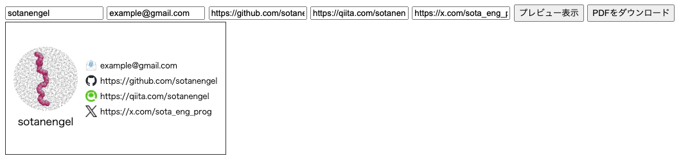

# エンジニア名刺ジェネレータ
[サイト](https://sotanengel.github.io/engineer-meishi-generator/)にアクセスして、必要な情報を入れるとラクスルで印刷可能な名刺をPDF形式で作成します。

# ラクスルサイトでの印刷方法
1. [名刺作成ページ](https://design.raksul.com/products/business_card)へ移動
2. 「白紙から作成」→オンライン作成ページは空白のまま「確認して注文に進む」→「名刺購入に進む」
3. 用紙の種類を選美、カートに入れる
4. カート画面でデータを入稿し、購入する
